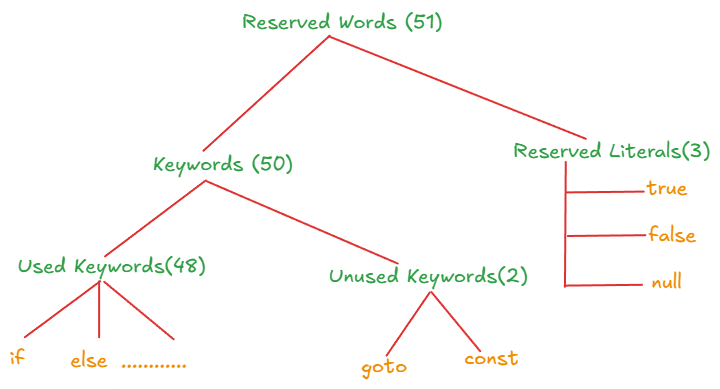

# Language Fundamentals

- [Identifiers](#1-identifiers)
- [Reserved Words](#2-reserved-word) 
- [Data Types](#basic-concepts)
- [Literals](#advanced-topics)
- [Types of Variables](#contributing)
- [Var - Arg Methods](#contributing)
- [Main Method](#contributing)
- [Command Line Arguments](#contributing)
- [Java Coding Standards](#contributing)

## 1. Identifiers
Name in java program is called Identifier. Which can be used for Identification purpose. It can **Method name, variable name, class name or label name**.

<pre> 
class Test{
    public static void main(String[] args){
        int x = 7;
    }
}
// Test, main, String, args, int, x this are Identifiers
</pre>

### Rules For Defining Java Identifiers

- Only allowed characters are 
  - A–Z
  - a–z
  - 0–9
  - $ and _

- Cannot start with:
  - A digit (0–9)

- Identifiers are:
  - Case-sensitive
  - Unlimited length
  - Can't use Reserved word as Identifier
  - All Pre-Defined java class name & interface name we can use as identifers
  <pre>
  Class Test{
    public static void main(String[] args){
      int String = 10;
      System.out.println(String);

      int Runnable = 100;
      System.out.println(Runable);
    }
  }
  // But not recommandded Runs Code but its not point
  </pre>

  - Example

  <pre>
  class TestIdentifiers {
    int age = 25;         // valid
    int _salary = 50000;  // valid
    int $bonus = 1000;    // valid
    // int  = 100;   // ❌ Invalid: starts with digit
    // int all@num = 50; // ❌ Invalid: contains hyphen
    // int class# = 1;       // ❌ Invalid: reserved keyword
    // int = 1;       // ❌ Invalid: reserved keyword

  }

  </pre>

  ## 2. Reserved Word
  Some word are reserved to **represent some meaning & functionality such type of words** are called reserved word.

  

  ### Keywords for Data Types
    - `byte`
    - `short`
    - `int`
    - `long`
    - `float`
    - `double`
    - `boolean`
    - `char`

  ### Keywords for Flow Control
    - `if`
    - `else`
    - `switch`
    - `case`
    - `deafault`
    - `while` 
    - `do`
    - `break `
    - `continue`
    - `return`
    - `for`

  ### keywords for modifiers

  - `public`
  - `private`
  - `protected`
  - `static`
  - `final`
  - `abstract`
  - `synchronised`
  - `native`
  - `strictfp`
  - `transiant`
  - `volatile`

  ### Keyowrds for Exception Handelling
  - `try`
  - `catch`
  - `finally`
  - `throws`
  - `throw`
  - `assert`

  ### Class Related Keywords
  - `class`
  - `interface`
  - `extends`
  - `implements`
  - `package`
  - `import`

  ### Object relatyed Keywords
  -`new`
  - `instenceof`
  - `super`
  - `this`

  ### retrun type keyword
  - `void`
  > In java return type is mandatory if method won't return anything then we have to declare that method with the void return type. But C language we can't use void deafault return type is int.
  

  ### unused keywords 

  - `goto`
  > Usage of goto crated serveal problems in old languages and hence some banned this keyword in java.
  - `const`
  > use **final** insted of const.
  > goto & const is unused keyword if you're trying to use getting compile time error

  ### Reserved literals
  - `true`
  - `false`
   > true & false are boolean data types.

  - `null`
 
  > null-- Deafault value for object referance

  ### `enum`
  > to defined group named constants.
  <pre>
  enum month{
    JAN . . . . Dec
  }
  </pre>

> All 53 reserved words in java contains Only lowercase alphabets words.

> In java only **new** keyword not **delete** keyword in java because destruction of useless objects is the resposibilty of garbage collector.
> 1. `strictof` butnot StrictFp 
> 2. `instanceof` butnot instanceOf
> 3. `synchronized` butnot Synchronized
> 4. `extends` butnot extend
> 5. `implements` but not implement
> 6. `import` butnot imports
> 7. `const` butnot constant

### Interview Questions
which of following list contains only java reserved words 
> new, delete
> goto, constant
> break, continue, return, exit
> final, finally, finalize
> notify, notify all
> implements, extends, import
> sizeof, instanceof
> instanceOf, strictFp
> byte, short, Int
> None of the above

which of the following java reserved words

>public
>static
>void
>main
>String
>args