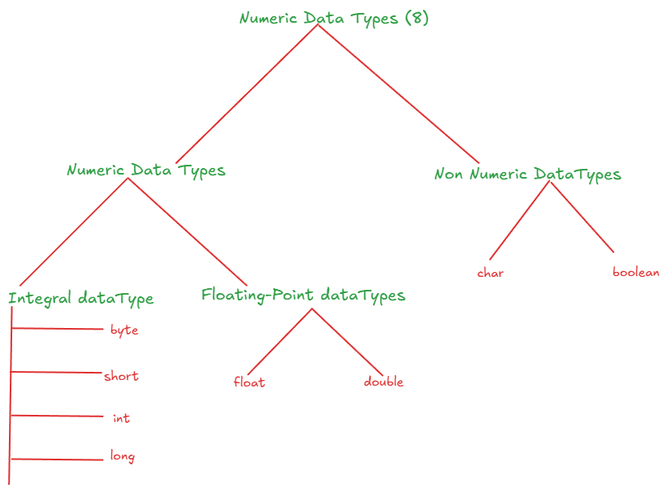
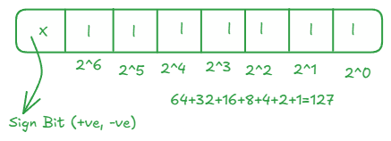

# Language Fundamentals

- [Identifiers](#1-identifiers)
- [Reserved Words](#2-reserved-word) 
- [Data Types](#3-data-types)
- [Literals](#advanced-topics)
- [Types of Variables](#contributing)
- [Var - Arg Methods](#contributing)
- [Main Method](#contributing)
- [Command Line Arguments](#contributing)
- [Java Coding Standards](#contributing)

## 1. Identifiers
Name in java program is called Identifier. Which can be used for Identification purpose. It can **Method name, variable name, class name or label name**.

<pre> 
class Test{
    public static void main(String[] args){
        int x = 7;
    }
}
// Test, main, String, args, int, x this are Identifiers
</pre>

### Rules For Defining Java Identifiers

- Only allowed characters are 
  - A–Z
  - a–z
  - 0–9
  - $ and _

- Cannot start with:
  - A digit (0–9)

- Identifiers are:
  - Case-sensitive
  - Unlimited length
  - Can't use Reserved word as Identifier
  - All Pre-Defined java class name & interface name we can use as identifers
  <pre>
  Class Test{
    public static void main(String[] args){
      int String = 10;
      System.out.println(String);

      int Runnable = 100;
      System.out.println(Runable);
    }
  }
  // But not recommandded Runs Code but its not point
  </pre>

  - Example

  <pre>
  class TestIdentifiers {
    int age = 25;         // valid
    int _salary = 50000;  // valid
    int $bonus = 1000;    // valid
    // int  = 100;   // ❌ Invalid: starts with digit
    // int all@num = 50; // ❌ Invalid: contains hyphen
    // int class# = 1;       // ❌ Invalid: reserved keyword
    // int = 1;       // ❌ Invalid: reserved keyword

  }

  </pre>

  ## 2. Reserved Word
  Some word are reserved to **represent some meaning & functionality such type of words** are called reserved word.

  

  ### Keywords for Data Types
    - `byte`
    - `short`
    - `int`
    - `long`
    - `float`
    - `double`
    - `boolean`
    - `char`

  ### Keywords for Flow Control
    - `if`
    - `else`
    - `switch`
    - `case`
    - `deafault`
    - `while` 
    - `do`
    - `break `
    - `continue`
    - `return`
    - `for`

  ### keywords for modifiers

  - `public`
  - `private`
  - `protected`
  - `static`
  - `final`
  - `abstract`
  - `synchronised`
  - `native`
  - `strictfp`
  - `transiant`
  - `volatile`

  ### Keyowrds for Exception Handelling
  - `try`
  - `catch`
  - `finally`
  - `throws`
  - `throw`
  - `assert`

  ### Class Related Keywords
  - `class`
  - `interface`
  - `extends`
  - `implements`
  - `package`
  - `import`

  ### Object related Keywords
  - `new`
  - `instenceof`
  - `super`
  - `this`

  ### retrun type keyword
  - `void`
  > In java return type is mandatory if method won't return anything then we have to declare that method with the void return type. But C language we can't use void deafault return type is int.
  

  ### unused keywords 

  - `goto`
  > Usage of goto crated serveal problems in old languages and hence some banned this keyword in java.
  - `const`
  > use **final** insted of const.
  > goto & const is unused keyword if you're trying to use getting compile time error

  ### Reserved literals
  - `true`
  - `false`
   > true & false are boolean data types.

  - `null`
 
  > null-- Deafault value for object referance

  ### `enum`
  > to defined group named constants.
  <pre>
  enum month{
    JAN . . . . Dec
  }
  </pre>

> All 53 reserved words in java contains Only lowercase alphabets words.

> In java only **new** keyword not **delete** keyword in java because destruction of useless objects is the resposibilty of garbage collector.
> 1. `strictof` butnot StrictFp 
> 2. `instanceof` butnot instanceOf
> 3. `synchronized` butnot Synchronized
> 4. `extends` butnot extend
> 5. `implements` but not implement
> 6. `import` butnot imports
> 7. `const` butnot constant

### Interview Questions
which of following list contains only java reserved words 
> new, delete
> goto, constant
> break, continue, return, exit
> final, finally, finalize
> notify, notify all
> implements, extends, import
> sizeof, instanceof
> instanceOf, strictFp
> byte, short, Int
> None of the above

which of the following java reserved words

>public
>static
>void
>main
>String
>args

## 3. Data Types

In java every variable & expression has some type.
Each an every data type is clearly defined.
Every assignment by check by compiler for Type Compatibility
Because of above reason we can canclude java language is **Strongly Typed**
Java is not consider as pure object orineted language beacause several not satisfyed by java like operated overloading & multimulple inheritence
we're depends on premitive data type which non objects.

> Expect boolean & char remaining data type as signed data types beacause we can represent both +ve & -ve Numbers.

- `byte` - Size 1byte(8 bits) 
              max_value (127)
              max_value (-127)
              range (-127 to 127)
                

      > `Erorr's` - <pre> byte b = 10; 
                      byte b=128; # Compitable Erorr: possibleloss of precision
                      byte b =10.5 #Compile time error: possibleloss of precision
                                  # found : double
                                  #required :byte
                      byte b = true; #found : boolean
                      byte b = "Satyajit" #found : java.util.String
  </pre>

  > Byte u=is best choice i you want to handel data in terms of streams either form file or form the network (file supported or network supported file in byte).

- `short` - size : 2bytes (16bits)
            Range : -2^-15 to 2^15 -1 (-32768 to 32767)

  > This is most rarely used in java

  > `Error` - <pre> short s=32767;
                    short s =32768; found:int
                    short s =10.2; found:double
                    short s =10.2; found:boolean
  
  </pre>

- `int` - IT's most useable data type in java.
            Size - 4bytes (32bits)
            Range - 2^31 to 2^31 -1 (-2147483648 to 2147483647)

    > `Erorr` - <pre> int x = 2147483647;
                        int x = 2147483648; found : integer num too long
                        int x = 214748364L; Found: Long
                        int x = true; Found: boolean                   
    </pre>                                                                                                                                    

- `long` - Sometimes int may not enough hold to big values then we should go fo long type.
            Ex. 1 - The amount of distance 1000 times to hold of this value so we go with long Datatype.
            long l = 126000 * 60 * 60 *60 *1000
            Ex. 2 - the of cahracters present big file may exced int range hence the retrun of length method is long but not int
            long l = f.length();
    > Size : 8Bytes (64bits)
    > Range: -2^63 to 2^63 -1 

    > Note : This data type only represent integral ` byte, short, long, int` if we want floating point values then we should going for floating point data types.

-  `float` and `double`

| Aspect              | float                                 | double                                 |
|---------------------|----------------------------------------|----------------------------------------|
| Precision           | 7 decimal digits single Precision                      | 15–16 decimal digits double Precision                  |
| Size                | 4 bytes                               | 8 bytes                                |
| Range               | ~ ±3.4×1038                | ~ ±1.7×10308               |
| Default Type        | Not default for decimals              | Default for decimal values             |
| Storage & Speed     | Requires less memory, faster          | Requires more memory, slightly slower  |
| Use Case            | When memory is limited                | When higher precision is needed        |
| Example Declaration | `float price = 5.75f;`                | `double value = 5.75;`                 |

- `true` and `false` - Size : Not applicable
                      Range: Not applicable
  > `Error` - <pre> boolean b = true;
                    boolean b = 0; #Found int
                    boolean b = True; #cannot find symbol Symbol. Symbol: true
                    boolean b = "true"; #found : java.lang.string
  </pre>

